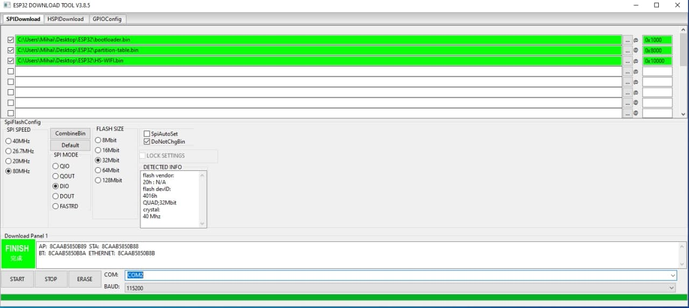

# HS402 PCB V3.0
## Changelog
- New TPS73733 to generate 3.3v reference
- New Wifi module added to PCB (optional)
- Fixed var cap pads dimension
- Updated components list with pictures of the components

## Flashing ESP32
Download the files from the Firmware folder. Connect the ESP32 development board to the PC with the USB cable.

### By Command line (change COM port number and filenames)
    esptool.py -p COM15 -b 460800 --before default_reset --after hard_reset --chip esp32 write_flash --flash_mode dio --flash_freq 80m --flash_size 2MB 0x8000 partition-table.bin 0x1000 bootloader.bin 0x10000 ESP32_firmware_V1.0_Beta.bin

(when the procedure start press both RESET (EN) and BOOT buttons, then release first the RESET (EN) button and then also the BOOT button)

### By using Espressif Flash Download Tool (Windows)
1. Download tool <a href="https://www.espressif.com/en/support/download/other-tools" target="_blank">here</a>, or from the ESP32 Firmware folder.
2. Load the files in the Download Tool as following. Set correctly the addresses and the COM port.

